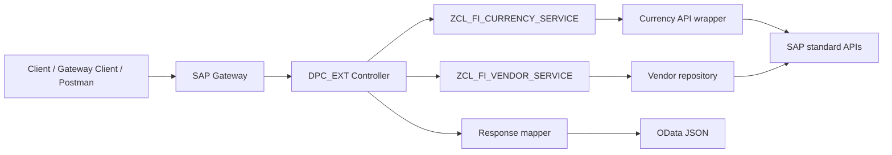

# SAP ECC OData V2 Function Import Demo

Production-oriented reference implementation for SEGW project `ZFI_FUNCTION_IMPORT_DEMO` and service `ZFI_FUNCTION_IMPORT_DEMO_SRV` (ABAP 7.40+).

> **Reference implementation:** This repository contains source-oriented SEGW guidance, not an SAP transport. Build and generate the SEGW project in your own ECC system, then apply the extension code. Validate FI authorization and open-item semantics with your functional team before productive use.

It demonstrates side-effect-free OData V2 Function Imports when an operation does not naturally fit CRUD: currency conversion returning one entity and vendor open-item lookup returning a collection.

## Architecture



## Repository layout

```text
src/abap/        ABAP class sources and SEGW extension methods
segw/             Entity model and Function Import configuration
docs/             Design, development, deployment, testing, troubleshooting
test/             Gateway Client examples and Postman collection
```

## Function Imports

| Import | Method | Parameters | Return |
|---|---|---|---|
| `ConvertCurrency` | GET | Amount, FromCurrency, ToCurrency, ExchangeRateDate | `CurrencyConversionResult`, 0..1 |
| `GetVendorOpenItems` | GET | CompanyCode, Vendor, KeyDate | `VendorOpenItem`, 0..n |

`GET` is intentional: both examples are read-only. Use `POST` for an action that changes state and implement CSRF handling.

## Function Import vs alternatives

Use a Function Import for named, parameterised domain operations. Use an Entity Set for queryable CRUD resources, Deep Entity for one transactional aggregate payload, and RAP Actions for RAP-based systems (not this ECC/SEGW OData V2 service).

## Installation and registration

1. Create SEGW project `ZFI_FUNCTION_IMPORT_DEMO` in the backend system, then create the model described in [segw/model.md](segw/model.md).
2. Generate runtime artifacts; replace generated `*_DPC_EXT` methods with [src/abap/zcl_fi_function_import_dpc_ext.abap](src/abap/zcl_fi_function_import_dpc_ext.abap), and create the support classes in package `ZFI_ODATA_DEMO`.
3. Activate all DDIC and class artifacts. The generated runtime extension class is normally `ZCL_ZFI_FUNCTION_IMPORT_DEMO_DPC_EXT`; copy/adapt the source file to that class. Register `ZFI_FUNCTION_IMPORT_DEMO_SRV` in `/IWFND/MAINT_SERVICE`, assign the system alias, then add the service.
4. Test metadata and requests in `/IWFND/GW_CLIENT`. See [docs/deployment-guide.md](docs/deployment-guide.md).

## Example requests

```http
GET /sap/opu/odata/sap/ZFI_FUNCTION_IMPORT_DEMO_SRV/ConvertCurrency?Amount='100.00'&FromCurrency='USD'&ToCurrency='EUR'&ExchangeRateDate=datetime'2026-07-28T00:00:00'
GET /sap/opu/odata/sap/ZFI_FUNCTION_IMPORT_DEMO_SRV/GetVendorOpenItems?CompanyCode='1000'&Vendor='0000100000'&KeyDate=datetime'2026-07-28T00:00:00'
```

Use URL encoding in real clients. Gateway normally serializes `DATS` parameters as `datetime'YYYY-MM-DDT00:00:00'` in OData V2.

## Security and operations

Protect the service with role-based Gateway/IWSG authorizations and enforce FI authorization checks in the service layer (for example `F_BKPF_BUK`). Do not expose unrestricted `BSIK` data. Avoid logging amounts or vendor identifiers unless the audit policy permits it. Refer to [docs/technical-design.md](docs/technical-design.md) for release-specific retrieval guidance.

## Testing

Import [test/postman/ZFI_Function_Import_Demo.postman_collection.json](test/postman/ZFI_Function_Import_Demo.postman_collection.json), then work through [docs/testing-guide.md](docs/testing-guide.md). Expected success and negative responses are supplied in `test/samples/`.

The endpoint-level contract is documented in [docs/api-reference.md](docs/api-reference.md). Contributions and repository conventions are in [CONTRIBUTING.md](CONTRIBUTING.md).

For a conceptual guide to Function Imports, their return types, and how they differ from RAP actions and Deep Entity operations, see [docs/function-import-notes.md](docs/function-import-notes.md).

## Common pitfalls

- Function Import parameters are read from `IT_PARAMETER`, not the entity-set query options.
- The SEGW parameter names, entity properties, ABAP mapping names, and runtime method name must match exactly.
- Do not use a generic `SELECT *` from FI line-item tables; select only response fields and bind company code/vendor/key date.
- Currency decimals and exchange-rate factors must be respected. The supplied wrapper uses `CONVERT_TO_LOCAL_CURRENCY` and exposes the rate returned by SAP.

## Future enhancements

## Future enhancements

Add unit tests with test doubles, application log correlation IDs, paging/filtering for the item list, service-specific authorization objects, and an approved released API adapter for newer backends. Add support to explore `$expand` with Function Imports and expanded return entity types using associations.

