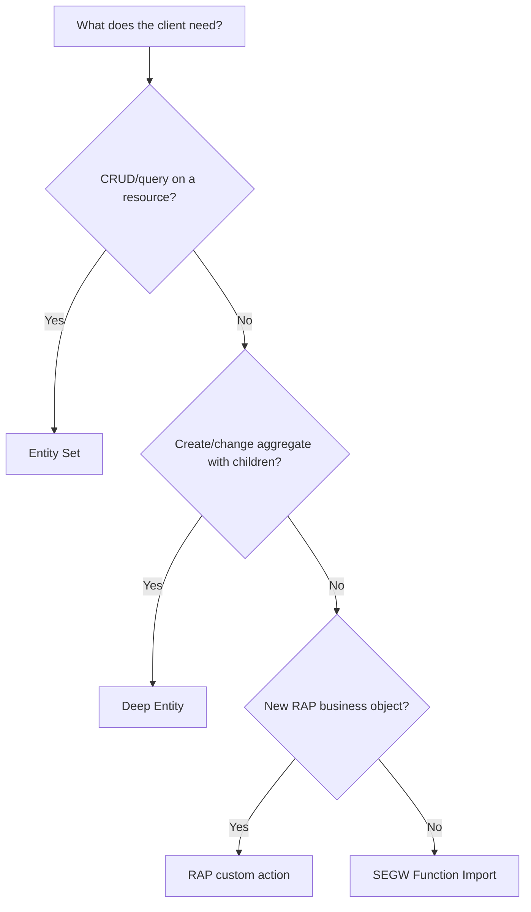

# SAP OData V2 Function Import notes

## What is a Function Import?

An OData V2 Function Import is a named service operation exposed in the service metadata. A client calls it with explicit parameters, and SAP Gateway routes the request to `DPC_EXT=>/IWBEP/IF_MGW_APPL_SRV_RUNTIME~EXECUTE_ACTION`.

It represents a **business operation**, rather than CRUD on an entity set. In SEGW, define its name, HTTP method, import parameters, return entity type/entity set, and cardinality. The runtime implementation reads `IT_PARAMETER`, delegates to a service class, then returns the result through `COPY_DATA_TO_REF`.

## When to use one

Use a Function Import when the intent is an operation with a meaningful verb and parameters, and it does not naturally model as create/read/update/delete of a single resource.

Typical scenarios:

| Scenario | Example Function Import | Why CRUD is a poor fit |
|---|---|---|
| Calculation | `ConvertCurrency` | A calculation is not an entity to create or update |
| Validation/simulation | `ValidatePosting`, `SimulatePayment` | The caller requests a business decision, not a resource |
| Controlled search | `GetVendorOpenItems` | Several business inputs drive a defined FI lookup |
| Workflow command | `ApproveInvoice`, `ReleasePayment` | The operation expresses a state transition |
| Integration command | `RetryOutboundMessage` | The intent is an explicit side effect |
| Aggregation | `GetCashPosition` | The response is computed from several sources |

Use `GET` only for safe, read-only operations such as calculation or lookup. Use `POST` for operations with side effects, such as approval or release; apply CSRF protection, idempotency rules, authorization, and audit logging.

Do **not** use a Function Import merely to bypass an entity-set query. If the client needs standard filtering, sorting, paging, `$select`, navigation, and CRUD, expose an Entity Set instead.

## Return types and cardinality

SEGW OData V2 Function Imports can return a primitive value, a complex type, an entity type, or a collection (depending on the SEGW/Gateway release and model configuration). For application APIs, entity type returns are usually the clearest because Gateway can serialize them consistently.

| Return shape | Typical cardinality | Example |
|---|---|---|
| Primitive | 1 | `IsPostingAllowed` → boolean |
| Complex type / structure | 0..1 or 1 | `SimulateTax` → amount breakdown |
| Single entity | 0..1 or 1 | `ConvertCurrency` → `CurrencyConversionResult` |
| Collection of entities | 0..n | `GetVendorOpenItems` → `VendorOpenItem` list |

For this demo, `ConvertCurrency` returns one `CurrencyConversionResult` entity (`0..1`) and `GetVendorOpenItems` returns a `VendorOpenItem` collection (`0..n`). Choose cardinality deliberately and keep it stable because clients build against `$metadata`.

## Function Import vs RAP custom action

RAP actions and SEGW Function Imports both express business verbs, but they belong to different programming models.

| Topic | SEGW Function Import | RAP custom action |
|---|---|---|
| Primary platform | SAP Gateway, OData V2, classic ABAP/ECC | RAP, normally ABAP Platform/S/4HANA, OData V4 or V2 binding |
| Definition | SEGW service model | Behavior definition (`action`) |
| Implementation | `DPC_EXT=>EXECUTE_ACTION` plus service classes | Behavior pool action implementation |
| Transaction model | Developer controls it explicitly | RAP manages transactional behavior, EML, validations/determinations |
| Best for | Existing ECC/SEGW services and operation endpoints | New RAP business objects and lifecycle-aware actions |
| Example | Convert currency, lookup FI items | Approve a purchase request on a RAP BO |

For an ECC SEGW service, use a Function Import. For a new S/4HANA/ABAP Cloud application built on RAP, prefer a RAP action when it operates on a RAP business object and should participate in its authorization, draft, validation, and transaction lifecycle. Do not introduce RAP solely to replace a small existing SEGW operation.

## Function Import vs Deep Entity

A Deep Entity request sends or retrieves an entity together with related child entities as one aggregate payload. In Gateway OData V2, custom create handling normally uses `CREATE_DEEP_ENTITY`.

| Question | Function Import | Deep Entity |
|---|---|---|
| Core intent | Execute a named business operation | Create/change one aggregate and its children |
| Input | Named scalar parameters, sometimes an operation payload | Nested header/item entity payload |
| Typical method | GET for read-only; POST for commands | Usually POST for aggregate creation |
| Example | `SimulatePayment` | Create sales order with header and items |
| Appropriate when | The verb/calculation/workflow is the API | The resource graph is the API |

Use Deep Entity when a client creates or updates a transactional root with its dependent data in one logical request. Use a Function Import when the caller is asking SAP to perform a business operation, calculation, validation, search, or workflow command. A Function Import may return a deep-like result only when that output is truly the operation result; it should not replace a well-modelled entity graph.

## Decision guide

Whatever option you choose, make authorization, validation, errors, performance limits, and idempotency explicit in the contract.
