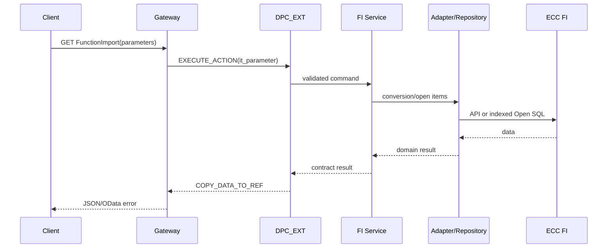

# Technical design

## Requirements

The service converts a monetary amount for a date and returns vendor open items for a company code, vendor, and key date. It is read-only, validates inputs, maps controlled response contracts, and returns Gateway business errors for expected failures.

## Component and sequence design

Expected validation failures raise `/IWBEP/CX_MGW_BUSI_EXCEPTION` (normally HTTP 400); unexpected errors raise `/IWBEP/CX_MGW_TECH_EXCEPTION` and must be correlated in logs without sensitive values. Enforce Gateway service authorization plus an organisation-approved FI company-code check such as `F_BKPF_BUK` in the service layer.

`BSIK` is an ECC open-item index and a deliberate extension point, not universal accounting truth. FI must approve special G/L, clearing/as-of semantics, privacy, indexes, and result limits; replace the repository with a released/approved FI adapter where appropriate.

Package `ZFI_ODATA_DEMO`: generated provider classes; DPC extension; currency service/API interface; vendor service/repository; exception. Constructor injection enables ABAP Unit doubles.
